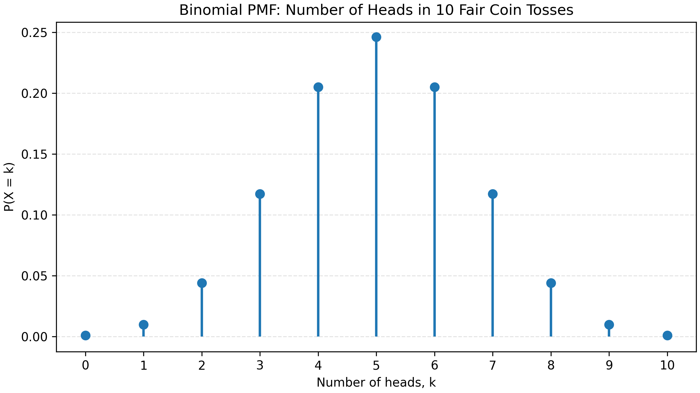

The binomial distribution models the number of times an event occurs (sometimes referred to as the "number of successes") in a fixed number of independent trials. Its probability mass function is:

$$
P(X = k) = \binom{n}{k}p^k(1-p)^{n-k},
$$

where $n$ is the number of trials, $k$ is the number of successes, and $p$ is the probability of success in one trial.

# Common Notations

The following are common notations for a binomial random variable with $n$ trials and success probability $p$:

- $X \sim \mathrm{Bin}(n,p)$
- $X \sim \mathrm{Binomial}(n,p)$
- $X \sim B(n,p)$

where $X$ is the random variable denoting the number of successes.

# Requirements

For the binomial distribution to be applicable, the following requirements must be met:

1. There are a fixed number of trials, $n$.
2. Each trial is independent of the others.
3. Each trial has only two possible outcomes: success or failure.
4. The probability of success, $p$, is the same for each trial.

# Example

Suppose we flip a fair coin 10 times. The number of heads observed follows a binomial distribution with $n = 10$ and $p = 0.5$. The probability of getting exactly 6 heads is

$$
P(X = 6) = \binom{10}{6}(0.5)^6(1-0.5)^{10-6} \approx 0.205.
$$

The overall probability mass function is displayed in the figure below:

